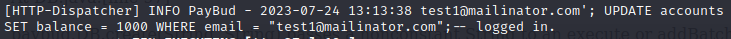
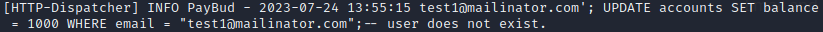
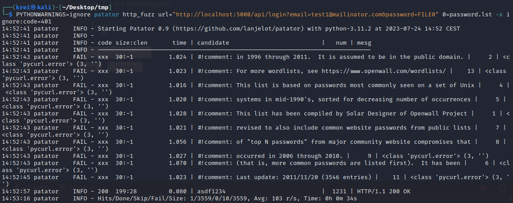
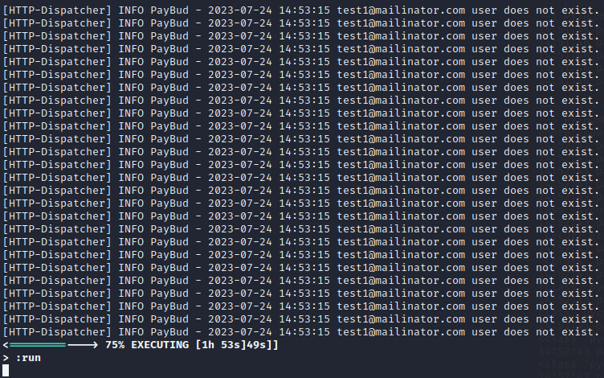

# Assignment 3
_- Kristian Moltke Reitzel, krei@itu.dk_

The report and the source code can be accessed on:
https://github.com/kmoltke/AIS-Assignments/tree/main/a3

## Problem 1

### Part 1
1. Assets: **Money, email**
2. Threats: **Malicious users**. All malicious users who have no moral and wants to steal other user's money or credits. Their capabilities are known and unknown methods of exploiting systems.
3. Harm: Loss of money (**integrity**), violation of email (**confidentiality**)

### Part 2
1. The system should prevent loss of user's account balance.
2. The system should detect unauthorized access to user's account information.

### Part 3
1. Transfer of money should only be allowed by the user who owns the account.
2. Unauthorized access to the database should be logged and notified to the admins.

## Problem 2
Possible relevant operations to log:
- create
- forgot
- login
- balance
- send
- deposit
- withdraw
- logout

I have chosen login and modified the function like so:
``` Java
private static void login(final HttpExchange io){
    if ( authenticated(io) ){
        respond(io, 409, "application/json", json("Already logged in."));
        return;
    }
        
    final Map<String,String>  qMap = queryMap(io);
    final String email = qMap.get("email");
    final String password = qMap.get("password");
    final Optional<String> result = DB.login(email, password);

    final boolean loginSuccess = (result != null);
    if ( ! loginSuccess ){
        respond(io, 400, "application/json", json("Syntax error in the request."));
        log(io, email + " and " + password + " has a syntax error.");
        return;
    }

    final boolean userExists = result.isPresent();
    if ( ! userExists ){
        respond(io, 401, "application/json", json("Email and password are invalid."));
        log(io, email + " provided invalid password.");
    } else {
        respond(io, 200, "application/json", json("Login successful."));
        log(io, email + " logged in.");
    }
}

private static void log(HttpExchange io, String msg) {
    log.info(io.getRemoteAddress().toString() + " - [" + dateformat.format(new Date()) + "]: " + msg);
}
```


## Problem 3
### Part 1
SQL vulnerability: Passing a non-constant String to an execute statement.

Location: DB.java:[line 43]
### Part 2
A current user can set his/her account balance to e.g. 1000 with this SQL injection. This will also log the user in without having to type a valid password.
```test1@mailinator.com'; UPDATE accounts SET balance = 1000 WHERE email = "test1@mailinator.com";--```
### Part 3

_Note: I changed the log print afterwards to also include the IP of the request_

### Part 4
This violates both security requirements.

### Part 5
To use a `prepareStatement` method. This ensures that the "parameter" into the sql statement is only that one single parameter and also that only one exact query will be executed.

### Part 6
Modification of the login method:
``` JAVA
public static Optional<String> login( final String email, final String password ) {
    final String q = "SELECT * FROM users WHERE email=? AND password=?";
    try {
        Connection c; ResultSet r; String u;
        c = DriverManager.getConnection(URL);
        PreparedStatement ps = c.prepareStatement(q);
        ps.setString(1, email);
        ps.setString(2, password);
        r = ps.executeQuery();

        if ( r.next() ){ // true iff result set non-empty, implying email-password combination found.
            u = r.getString("email");
        } else {
            u = null;
        }
        c.close();
        return Optional.ofNullable(u); // empty iff u = null
    } catch ( Exception e ) {}
    return null; // exception occurred; malformed SQL query?
}
```

The same sql-injection will no longer work:


_Note: I changed the log print afterwards to also include the IP of the request_


## Problem 4
### Part 1
Command for `patator`:



Correctly guessing the **super** secret password: `asdf1234`

### Part 2
Brute force

### Part 3
It is clear in the log, that something fishy is happening because it appears that the same user tries to log in several of times a second, which is not possible for a human being to do manually.



## Problem 5
1. U -> C: {email, password}

2. C -> S: {email, password}

3. S -> U: {email: token}

4. U -> C: {token}

5. C -> S: {token}

6. S -> C: {menuPage}


### Implementation
Implementation of 2FA can be found on my repo: https://github.com/kmoltke/AIS-Assignments

_DISCLAIMER: the program doesn't work on Chrome browser. I think it must be something about the cookies._

I mostly did changes to following files:

- **webServer.java**: `genToken()`, `authToken()`
- **DB.java**: `createToken()`, `getToken()`
- **api.js**: `genTokenReq()`, `tokenReq()`
- **/login/code.js**: `tokenform()`

DDL:
``` SQLite
PRAGMA foreign_keys = ON;

CREATE TABLE tokens (
    email TEXT PRIMARY KEY,
    token TEXT,
    time TEXT,
    FOREIGN KEY (email)
        REFERENCES users (email)
);
```

## Problem 6
### Part 1
The communication is not encrypted.

### Part 2
1. U -> C: {login} - 
2. C -> A: {login} - _The attacker intercepts login_
3. A -> S: {login} - _The attacker acts as the client and sends login request to server_
4. S -> A: {email: token} - _The server sends token to attacker_
5. A -> U: {email: token} - _Attacker sends a fake message to the user containing the token_
6. U -> C: {token} - _User, thinking it's the legitimate token, sends it back to client_
7. U -> A: {token} - _Attacker intercepts the token from user intended for client_
8. A -> S: {token} - _Attacker sends token to server_
9. S -> A: {menuPage} - _Man-in-the-middle attack successful_

A tool that is installed on Kali for man-in-the-middle attack can e.g. be `Ettercap`.

### Part 3
Logging might reveal the man in the middle attack, if it detects an abnormal pattern in the communication. I.e. if the log contains the IP of the requests.
If the client is compromised then it is more difficult to track since the IP of the client might be the same as the server expect.