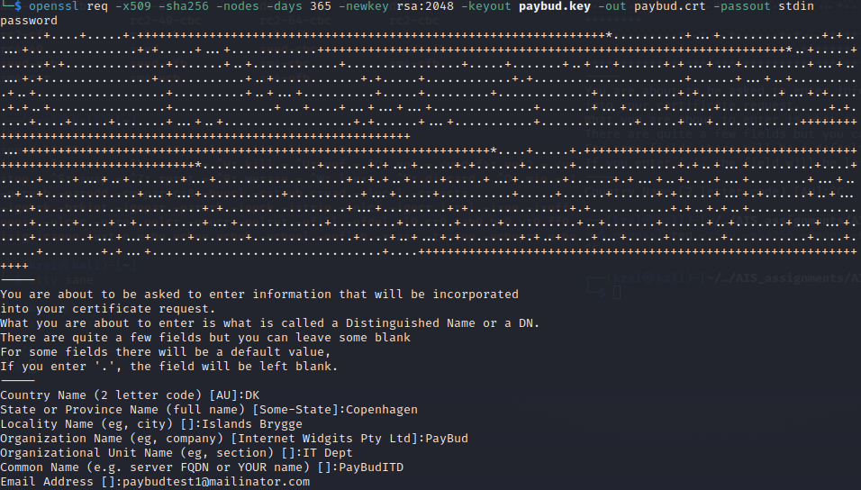

# Assignment 4
_Kristian Moltke Reitzel, krei@itu.dk_

## Problem 1
### Part 1
```shell
gpg --decrypt --passphrase takethis symmetric.txt.gpg
```

```shell
echo "kristian" > mysymmetric.txt
```

```shell
gpg --symmetric  mysymmetric.txt
```

```shell
gpg --decrypt --passphrase takethis mysymmetric.txt.gpg
```

```shell
gpg --gen-key
```

```shell
gpg --import bob_pub.key
```

```shell
gpg --encrypt --sign --recipient 'Bob Ross'  mypublic.txt
```

```shell
gpg --output mypublickey.gpg --export gpgtest1@mailinator.com
```

### Part 2

```shell
openssl pkcs12 -export -in paybud.crt -inkey paybud.key -out paybud.p12 -name paybud -caname root
```

### Part 3
When someone signs another person's key, they are essentially vouching for the authenticity of that person's identity. The act of signing someone's key implies that the signer has verified the identity of the key's owner and is asserting that the key indeed belongs to that person.

e.g.
55921c9468e36ab22a937d070e2b84019a7db7b0 signed for freysteinn@freysteinn.com

[selfsig] is a digital signature made by the key owner on their own key or User ID, which means that they sign for his own identity.

"revok" is short for "revoke," and it indicates that the corresponding key or signature has been revoked, which means that the owner of the key or the signer no longer vouches for the authenticity of the key or the data they signed

The Web of Trust is a decentralized trust model used in PGP and GnuPG to establish and verify the authenticity of public keys. In the Web of Trust, users can sign each other's keys to create a network of trust relationships. For example, Freysteinn Alfredsson freysteinn@freysteinn.com and Freysteinn Alfredsson freysteinn@1984.is have both signed each other's keys, creating a mutual trust relationship.

### Part 4
#### Depth

Refers to the level of certificate validation in the certificate chain. Each depth represents a certificate in the chain, starting from the end-entity certificate (depth 0) up to the root certificate.

#### Root CA
Root CAs are considered the trust anchors of the certificate infrastructure because they are self-signed, and their public keys are pre-installed in web browsers and operating systems. These trusted root certificates are used to verify the authenticity of other certificates in the chain, establishing a chain of trust from the root to the end-entity certificate.

#### Hex-coded modulus
t is part of the public key that helps to encrypt data and verify digital signatures. The modulus is typically represented in hexadecimal format, as seen in the provided output. In this case, the modulus is a 2048-bit value represented as a series of hexadecimal numbers.

#### ITU CA?
The certificate for *.itu.dk (ITU's domain) is signed by GlobalSign, a well-known public CA, as evidenced by the issuer field (Issuer: C = BE, O = GlobalSign nv-sa, CN = GlobalSign RSA OV SSL CA 2018). It means that GlobalSign is the CA responsible for verifying and issuing the certificate for ITU's domain.

#### Chain of trust
- Depth 0: *.itu.dk (End-entity certificate)
- Depth 1: GlobalSign RSA OV SSL CA 2018 (Intermediate certificate)
- Depth 2: GlobalSign Root CA - R3 (Root certificate)

### Part 5
The server still supports TLS version 1.0 and 1.1.

TLS 1.0 and 1.1 use older cryptographic algorithms, some of which have been found to be weak over time due to advances in computational power and cryptanalysis. This could expose users to attackers who can exploit these weak encryption algorithms to intercept or manipulate data. These attacks could potentially compromise the confidentiality and integrity of data being transmitted between the user's browser and the server.

