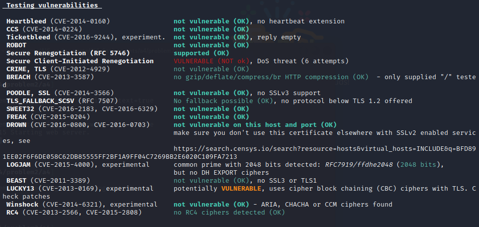

# Assignment 4
_Kristian Moltke Reitzel, krei@itu.dk_

Source code and files for [Problem 1](#problem-1) is available [here](https://github.com/kmoltke/AIS-Assignments/tree/main/a4)

## Problem 1
### Part 1
```shell
gpg --decrypt --passphrase takethis symmetric.txt.gpg
```

```shell
echo "kristian" > mysymmetric.txt
```

```shell
gpg --symmetric  mysymmetric.txt
```

```shell
gpg --decrypt --passphrase takethis mysymmetric.txt.gpg
```

```shell
gpg --gen-key
```

```shell
gpg --import bob_pub.key
```

```shell
gpg --encrypt --sign --recipient 'Bob Ross'  mypublic.txt
```

```shell
gpg --output mypublickey.gpg --export gpgtest1@mailinator.com
```

### Part 2

```shell
openssl pkcs12 -export -in paybud.crt -inkey paybud.key -out paybud.p12 -name paybud -caname root
```

### Part 3
When someone signs another person's key, they are essentially vouching for the authenticity of that person's identity. The act of signing someone's key implies that the signer has verified the identity of the key's owner and is asserting that the key indeed belongs to that person.

e.g.
55921c9468e36ab22a937d070e2b84019a7db7b0 signed for freysteinn@freysteinn.com

[selfsig] is a digital signature made by the key owner on their own key or User ID, which means that they sign for his own identity.

"revok" is short for "revoke," and it indicates that the corresponding key or signature has been revoked, which means that the owner of the key or the signer no longer vouches for the authenticity of the key or the data they signed

The Web of Trust is a decentralized trust model used in PGP and GnuPG to establish and verify the authenticity of public keys. In the Web of Trust, users can sign each other's keys to create a network of trust relationships. For example, Freysteinn Alfredsson freysteinn@freysteinn.com and Freysteinn Alfredsson freysteinn@1984.is have both signed each other's keys, creating a mutual trust relationship.

### Part 4
#### Depth

Refers to the level of certificate validation in the certificate chain. Each depth represents a certificate in the chain, starting from the end-entity certificate (depth 0) up to the root certificate.

#### Root CA
Root CAs are considered the trust anchors of the certificate infrastructure because they are self-signed, and their public keys are pre-installed in web browsers and operating systems. These trusted root certificates are used to verify the authenticity of other certificates in the chain, establishing a chain of trust from the root to the end-entity certificate.

#### Hex-coded modulus
t is part of the public key that helps to encrypt data and verify digital signatures. The modulus is typically represented in hexadecimal format, as seen in the provided output. In this case, the modulus is a 2048-bit value represented as a series of hexadecimal numbers.

#### ITU CA?
The certificate for *.itu.dk (ITU's domain) is signed by GlobalSign, a well-known public CA, as evidenced by the issuer field (Issuer: C = BE, O = GlobalSign nv-sa, CN = GlobalSign RSA OV SSL CA 2018). It means that GlobalSign is the CA responsible for verifying and issuing the certificate for ITU's domain.

#### Chain of trust
- Depth 0: *.itu.dk (End-entity certificate)
- Depth 1: GlobalSign RSA OV SSL CA 2018 (Intermediate certificate)
- Depth 2: GlobalSign Root CA - R3 (Root certificate)

### Part 5
The server still supports TLS version 1.0 and 1.1.

TLS 1.0 and 1.1 use older cryptographic algorithms, some of which have been found to be weak over time due to advances in computational power and cryptanalysis. This could expose users to attackers who can exploit these weak encryption algorithms to intercept or manipulate data. These attacks could potentially compromise the confidentiality and integrity of data being transmitted between the user's browser and the server.

## Problem 2
//TODO
### Part 1
1. U -> C: {email, password}
   - The user (U) initiates the login process by sending their login credentials (email and password) to the client (C).
2. C -> S: {email, password, 2FA_token}K
   - The client (C) forwards the received login credentials along with the user's 2FA token encrypted with the shared secret key K to the server (S).
3. S -> U: {2FA_response}K
   - The server (S) validates the 2FA token, generates a 2FA response, and sends it encrypted with the shared secret key K to the user (U).
4. U -> C: {2FA_response}K
   - The user (U) forwards the 2FA response encrypted with the shared secret key K to the client (C).
5. C -> S: {2FA_response}K
   - The client (C) forwards the 2FA response encrypted with the shared secret key K to the server (S) for final validation.
6. S -> C: {menuPage}K
   - If the 2FA response is valid, the server (S) sends the menu page encrypted with the shared secret key K to the client (C), granting access to the user (U).

**MitM:**
The attacker, who is in the middle of the communication, does not possess the shared secret key required to decrypt and encrypt messages correctly.

### Part 2
The certificate is not signed by a CA - i.e. it is self-signed. In general, it means that the site is not signed by a CA, so it could potentially be another site than what you intend to visit (e.g. by a MitM attack). 
For this scenario, it does not matter since we are in a development scenario.

### Part 3

- **LOGJAM:** A security vulnerability that allows attackers to weaken encrypted connections by exploiting weak Diffie-Hellman key exchange parameters.
- **BEAST:** A security vulnerability that enables attackers to decrypt parts of encrypted SSL/TLS traffic by exploiting weaknesses in the protocol's block cipher mode of operation.

### Part 4


Delete this line in WebServer.java:
```java
java.security.Security.setProperty("jdk.tls.disabledAlgorithms", disalg);
```

Add this line instead:
```java
java.security.Security.setProperty("jdk.tls.client.protocols", "TLSv1.2");
```

## Problem 3
### Part 1
Cross-site-scripting (XSS)

### Part 2
Legitimate login:
```
[HTTP-Dispatcher] INFO PayBud - /127.0.0.1:34292 - [2023-07-28 09:49:29]: emailalice@mailinator.com logged in.
[HTTP-Dispatcher] INFO PayBud - /127.0.0.1:57126 - [2023-07-28 09:49:32]: token sent to emailalice@mailinator.com
[HTTP-Dispatcher] INFO PayBud - /127.0.0.1:34292 - [2023-07-28 09:49:46]: emailalice@mailinator.com was successfully authenticated.
```

Malicious login (abnormal log behaviour):
```

```
I chose to log login events (including token authentication). When this XSS is being exploited, there will be no log for the login - which is bad. Of course if you logged all other operations e.g. withdraw, deposit, send etc. you would see an abnormality in the log, since there would not be the above three lines. But this is still not good practice, since an attacker would still harm confidentiality (i.e. see user's account balance) without the system knowing at all. To avoid this you would have to log when a user gets redirected to the `menuPage`. Then you would see the redirection but not the authentication lines in the log.

### Part 3
Create a keyEntry for the `HMACkey`:
````shell
keytool -genseckey -keystore paybud.p12 -storetype pkcs12 -keyalg HMacSHA512 -keysize 2048 -alias HMACkey -keypass password
````

Retrieve the `HMACkey` from the `KeyStore`:
````java
String hmacKeyAlias = "HMACkey";
KeyStore.SecretKeyEntry secretKey = null;
try {
   secretKey = (KeyStore.SecretKeyEntry) keysto.getEntry(hmacKeyAlias, new KeyStore.PasswordProtection(passwd.toCharArray()));
} catch (UnrecoverableEntryException e) {
   throw new RuntimeException(e);
}
hmacKey = secretKey.getSecretKey();
````

Create cookie with the calculated HMACkey:
```java
 private static void createCookie(final HttpExchange io, final String email){
     List<String> l = new ArrayList<String>();
     l.add("email=" + email + "; path=/");
     l.add("hash=" + calculateHMAC(email, hmacKey) + "; path=/");
     io.getResponseHeaders().put("Set-Cookie", l);
 }

 public static String calculateHMAC(String data, SecretKey key) {
     Mac mac = null;
     try {
         mac = Mac.getInstance(HMAC_SHA512);
         mac.init(key);
         return Base64.getUrlEncoder().encodeToString(mac.doFinal(data.getBytes()));
     } catch (NoSuchAlgorithmException | InvalidKeyException e) {
         throw new RuntimeException(e);
     }
 }
```

In the `goodCookie` function verify the cookie using the `calculateHMAC` function:
```java
final byte[] hash = Base64.getUrlDecoder().decode(getHash(io));
final byte[] calc = Base64.getUrlDecoder().decode(calculateHMAC(getEmail(io), hmacKey));

return Arrays.equals(hash, calc);
```

## Problem 4
### Part 1
In the DB.java file:

The `create` function now first hashes the passwords with salt and store them Base64 encoded:
```java
public static boolean create( final String email, final String password ) {

  byte[] salt = genSalt();
  String hashStr = null;
  try {
      hashStr = Base64.getEncoder().encodeToString(hashPwd(password, salt));
  } catch (NoSuchAlgorithmException | InvalidKeySpecException e) {
      throw new RuntimeException(e);
  }
  String saltStr = Base64.getEncoder().encodeToString(salt);

  final String iu = "INSERT INTO users VALUES ('" + email + "', '" + saltStr + "', '" + hashStr + "');";
  final String ia = "INSERT INTO accounts VALUES ('" + email + "', '0'); ";
  final String it = "INSERT INTO tokens (email) VALUES ('" + email + "');";
  try {
      Connection c; Statement s;
      c = DriverManager.getConnection(URL);
      c.setAutoCommit(false); // enter transaction mode
      s = c.createStatement();
      s.executeUpdate(iu);
      s = c.createStatement();
      s.executeUpdate(ia);
      s = c.createStatement();
      s.executeUpdate(it);
      c.commit();             // commit transaction
      c.setAutoCommit(true);  // exit transaction mode
      c.close();
      return true;
  } catch ( Exception e ) {}
  return false; // exception occurred; malformed SQL query?
}

private static byte[] genSalt() {
  SecureRandom random = new SecureRandom();
  byte[] salt = new byte[32];
  random.nextBytes(salt);
  return salt;
}

private static byte[] hashPwd(String password, byte[] salt) throws NoSuchAlgorithmException, InvalidKeySpecException {
  KeySpec spec = new PBEKeySpec(password.toCharArray(), salt, 100000, 256);
  SecretKeyFactory factory = SecretKeyFactory.getInstance("PBKDF2WithHmacSHA256");

  return factory.generateSecret(spec).getEncoded();
}
```

The `login` function must now decode this and uncypher (with the same `hashPwd` function) this:
````java
public static Optional<String> login( final String email, final String password ) {
  final String q = "SELECT * FROM users WHERE email=?";
  try (Connection c = DriverManager.getConnection(URL)) {
      String u; String hashword; String saltStr;
      PreparedStatement ps = c.prepareStatement(q);
      ps.setString(1, email);
      ResultSet r = ps.executeQuery();
      if (r.next()) {
          hashword = r.getString("hashword");
          saltStr = r.getString("salt");
          byte[] salt = Base64.getDecoder().decode(saltStr);
          byte[] hash = Base64.getDecoder().decode(hashword);
          if (Arrays.equals(hash, hashPwd(password, salt))) {
              u = r.getString("email");
          } else {
              u = null;
          }
      } else {
          u = null;
      }
      return Optional.ofNullable(u);
  } catch (SQLException | NoSuchAlgorithmException | InvalidKeySpecException e) {
      throw new RuntimeException(e);
  }
}
````

### Part 2
```shell
john --wordlist=/usr/share/john/password.lst users.txt
```


`--wordlist=/usr/share/john/password.lst` specifies the location of the wordlist file to be used by JohnTheRipper for attempting various combinations of passwords.

`users.txt` is the name of the file containing the hashed passwords that you want to crack.

JohnTheRipper will read the hashed passwords from `users.txt` and try each password entry against the wordlist `password.lst` to see if any of the hashes match. If a match is found, it means that the password in the wordlist is the one that corresponds to the hashed password in users.txt.

The purpose of using salt is to prevent attackers from using precomputed tables (rainbow tables) that contain a large number of precomputed hashes for commonly used passwords. Without salt, an attacker could simply look up the hash in the rainbow table and find the corresponding password. However, with salt, the attacker would need to generate new rainbow tables for each unique salt value, which significantly increases the computational effort and makes the attack much slower and more challenging.

### Part 3
Chosen password policies:
- Minimum 8 and maximum 16 characters
- Require at least one uppercase letter
- Require at least one lowercase letter
- Require at least one digit
- Require at least one special character

````java
private static PasswordValidator getPasswordValidator() {
  PasswordValidator validator = new PasswordValidator(
       new LengthRule(8, 16),                                 // Minimum and maximum password length
       new CharacterRule(EnglishCharacterData.UpperCase, 1),  // Require at least one uppercase letter
       new CharacterRule(EnglishCharacterData.LowerCase, 1),  // Require at least one lowercase letter
       new CharacterRule(EnglishCharacterData.Digit, 1),      // Require at least one digit
       new CharacterRule(EnglishCharacterData.Special, 1)     // Require at least one special character
  );

  return validator;
}
````

In the `create` function, validate the password:
````java
PasswordValidator validator = getPasswordValidator();
RuleResult ruleResult = validator.validate(new PasswordData(qMap.get("password")));

if (!ruleResult.isValid()) {
   respond(io, 400, "application/json", json("Password is not strong enough"));
   return;
}
````

### Part 4
1. To prevent Offline Dictionary / Brute-Force Attacks on weak passwords like PIN numbers, you can implement rate-limiting mechanisms, which restrict the number of login attempts allowed within a specific time frame, thus slowing down the attack.

2. Besides 2FA, to prevent Online Dictionary / Brute-Force Attacks, you can enforce account lockouts after a certain number of failed login attempts, implement CAPTCHA challenges, and use anomaly detection to identify and block suspicious login patterns in real-time.
