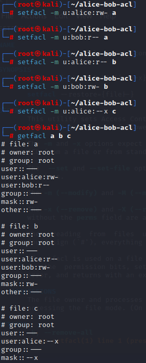
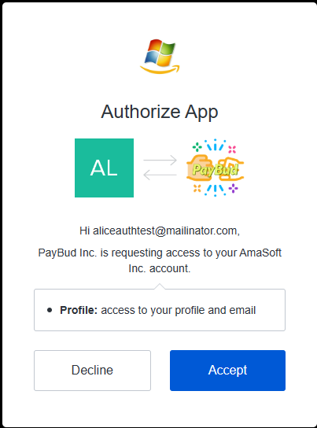
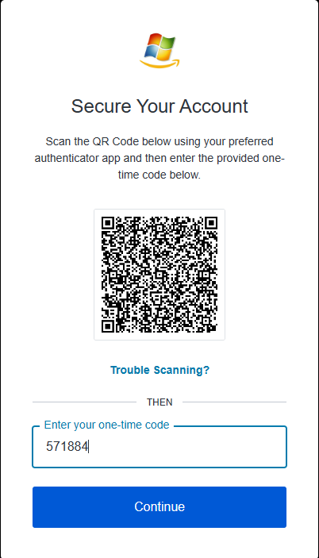

# Assignment 5
_Kristian Moltke Reitzel, krei@itu.dk_

Report and source code is available [here](https://github.com/kmoltke/AIS-Assignments/tree/main/a5)

<!-- TOC -->
* [Assignment 5](#assignment-5)
  * [Problem 1](#problem-1)
    * [Part 1](#part-1)
    * [Part 2](#part-2)
    * [Part 3](#part-3)
    * [Part 4](#part-4)
  * [Problem 2](#problem-2)
    * [Part 1](#part-1-1)
    * [Part 2](#part-2-1)
  * [Problem 3](#problem-3)
    * [Part 1](#part-1-2)
    * [Part 2](#part-2-2)
    * [Part 3](#part-3-1)
    * [Part 4](#part-4-1)
<!-- TOC -->

## Problem 1
### Part 1
File A:
- <Alice, {r, w}>
- <Bob, {r}>

File B:
- <Alice, {r}>
- <Bob, {r, w}>

File C:
- <Alice, {x}>
- <Bob, {}>

### Part 2
Alice:
- <FileA, {r, w}>
- <FileB, {r}>
- <FileC, {x}>

Bob:
- <FileA, {r}>
- <FileB, {r, w}>
- <FileC, {}>

### Part 3
Revoke all `write` permissions on file:
- For Acls you would have to update the Acls directly on that given file and remove all the write permissions for each user. 
- For Cls you would have to go through all users and check their Cls if they have write access to the given file and then change it.

Revoke all `write` permissions for user:
- For Acls you would have to go through ALL the Acls' that are stored on ALL files and check if the given user is in that Acls and then remove the write permisson.
- For Cls you would simply go to that users Cls and remove the write permission on all the files.

### Part 4



See `alice-bob-acl.tar` in this directory.

## Problem 2
### Part 1
Domain: `dev-c6f6btnyigx2q7v8.eu.auth0.com`
Client ID: `PPwV1wzDOd8QujEbWCaM3R5JrFI64pUf`



- **Resource Owner:** The user with the email aliceauthtest@mailinator.com
- **Client:** The application (PayBud Inc.) downloaded from the course page.
- **Authorization Server:** Auth0 IdP with the friendly name of AmaSoft in this case.
- **Resource Server:** Where the data is stored. In this case it is Auth0, but in reality it may be some other backend service.

### Part 2
1. Alice visits the application "PayBud Inc." to Sign up.
2. "PayBud Inc." redirects Alice to Auth0 (the Authorization Server) for authentication.
3. Alice enters her credentials and authenticates on the Auth0 login page.
4. Auth0 (Authorization Server) generates an authorization code and redirects Alice back to "PayBud Inc."
5. "PayBud Inc." requests an access token from Auth0 (Authorization Server) using the authorization code.
6. Auth0 (Authorization Server) validates the authorization code, client ID, and client secret.
7. Auth0 (Authorization Server) issues an access token to "PayBud Inc." over the Back Channel
8. Auth0 (Resource Server) validates the access token and allows access to Alice's resources.
9. "PayBud Inc." accesses resources on behalf of Alice using the obtained access token (also over the Back Channel)
10. "PayBud Inc." retrieves and displays Alice's data from Auth0 (Resource Server).

## Problem 3


After the Alice has provided her credentials (step 3):
1. Auth0 (Authorization server) generates an authorization code and requests the second factor (MFA) from Alice (Resource Owner)
2. Alice (Resource Owner) provides the second factor (e.g., one-time password from Microsoft Authenticator).
3. Auth0 (Authorization server) verifies the second factor (MFA) and completes Alice's authentication.

### Part 1
1. `input.action`

```json
"read"
```
2. `data.user_attributes[input.user]`
````json
{
   "tenure": 15,
   "title": "employee"
}
````
3. `data.pet_attributes[input.resource]`
````json
{
   "adopted": true,
   "age": 2,
   "breed": "terrier",
   "name": "toto"
}
````

### Part 2
1. what is the (data-)type of all 8 possible attributes?
- `boolean`
2. when is action_is_{read, update} true?
- When `input.action` is either `"read"` or `"update"`
3. when is user_is_{owner, employee, customer} true?
- `user_is_owner` is true when `data.user_attributes[input.user].role` is `"owner"` 
- Applies for same for employee and customer
4. when is user_is_senior true?
- `user_is_senior` is true when `data.user_attributes[input.user].role` is `"senior"`
5. when is pet_is_adopted true?
- `pet_is_adopted` is true when `data.pet_attributes[input.resource].adopted` is `true`.
6. when is allow true?
- `allow` is true when all the conditions in the policy are met, resulting in the decision to permit the action specified in the input query

### Part 3
1. default INPUT.
- `allow` = `true`
- `user_is_owner` is `false` for "bob" since his title is `"employee"`
- but `user_is_employee` AND `action_is_read` are `true`, so `allow` is also true.
2. user = alice.
- `allow` = `true`
- because `user_is_owner` is `true` for "alice" since her title is `"owner"`
3. user = dave.
- `allow` = `false`
- because all attributes are false. He almost gets all the checks in the last `allow if` statement, but unfortunately, dog123 is not adopted, so that one returns `false` as well.

### Part 4
Modification to POLICY:
```rego
allow if {
	input.action == "eat" 
    pet_is_less_than_or_equal_to_2_years
}

pet_is_less_than_or_equal_to_2_years {
    input_age := data.pet_attributes[input.resource].age
    input_age <= 2
}
```

1. Give example INPUT with action eat where allow is true.
````rego
{
   "user": "alice",
   "action": "eat",
   "resource": "dog123"
}
````

2. Give example INPUT with action eat where allow is false.
````rego
{
   "user": "bob",
   "action": "eat",
   "resource": "dog456"
}
````