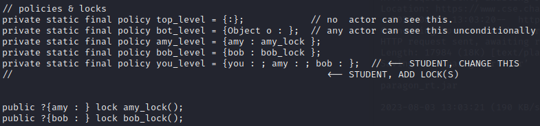
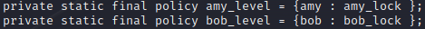
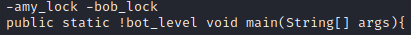
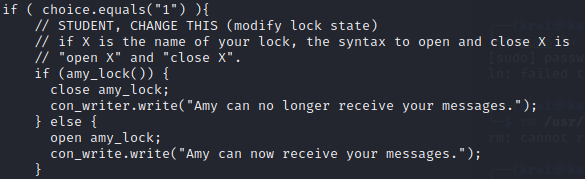

# Assignment 6

_Kristian Moltke Reitzel, krei@itu.dk_

## Problem 1: Basis of Trust

### Part 1
`<B, ax, Amasoft Inc.>`
- Unreasonable because there is no proof that Amasoft Inc. is trustworthy.
### Part 2
`<B, ax, Amasoft Inc.>`, `<T, an, me>`
- Somewhat reasonable assuming I can comprehend ALL reasonable inputs (i.e. the program is fairly simple).
### Part 3
`<B, ax, Amasoft Inc.>`, `<P, an, V>`, `<V, ax, me>`
- Pretty unreasonable since I blindly trust the third-party analytical program. However, if I have analyzed V to be a trustworthy program (i.e. `<V, an, me>`) then it would be somewhat reasonable.
### Part 4
`<B, ax, Amasoft Inc.>`, `<P, an, V>`, `<V, an, me>`
- This is reasonable since I have analyzed the third-party program and then uses it to verify `P` (i.e. this is kinda transitive).
### Part 5
`<B, ax, Amasoft Inc.>`, `<B, sy, B'>`, `<B', ax, me>`
- This is unreasonable since I blindly trust the trustworthiness of the third-party program, `B'`
### Part 6
`<Amy, an, M>`, `<M, sy, compiler>`, `<compiler(writer), ax, me>`
- This is unreasonable because 1) Amy might be malicious and 2) the compiler(writer) might be malicious.
### Part 7
`<M, an, Bob>`, `<Review, ax, me>`
- This is unreasonable since I blindly trust Bob's code review. He might be malicious or his review might be incomplete.
### Part 8
`<T, an, Amy&Bob>`, `<T, an, me>`, `<B, an, T>`
- This is reasonable since I have checked `T` to be trustworthy and then I use `T` to analyze `B` (Again transitive)
### Part 9
`<M, an, Amy>`, `<M, sy, commons-crypto>`, `<M, an, me>`, `<commons-crypto, ax, me>`
- This is unreasonable since I blindly trust that `commons-crypto` is trustworthy - it could change `M` maliciously even though it's just a thin wrapper.
### Part 10
`<M, an, Amy>`, `<M, an, me>`, `<M, an, Paragon>`, `<Paragon, ax, me>`
- This is _plausible_ reasonable, since Paragon is a dedicated extension to Java to help implement IFC. However, Paragon might of course have unknown vulnerabilities that I'm not aware of.

## Problem 2: IFC

### Part 1
The program **is** information-flow secure (i.e. noninterference). The reason is that `female` will be assigned `1` no matter what input. Hence, a L-observer will not learn anything.
### Part 2
`check` does **not** accept this program. Since a low variable is changed on a condition of a high variable.
### Part 3
`female = 1`. `female` will be assigned the value 1 twice.
### Part 4
`female = 1`. `female` will be assigned the value 1 once.
### Part 5
An L-observer would have to observe in-line leaks. 
### Part 6
An L-observer would never learn anything from the High level variable `sec`, since information never flows from high to low level AND the output of the program will never be dependant on the low level variables.
### Part 7
Check will also accept this program because no information from a high level variable will ever be directly or indirectly leaked to a low level variable.
### Part 8
If `sec` is initially even, the program will run forever (i.e. a forever loop) since `sec` will be multiplied by 2 and then modulus 2 of that value will also return 0, making the while condition true always.
### Part 9
An L-observer would know if the high level variable is even if the program crashes and know that it is uneven if the program completes.
### Part 10
If `sec` is even or uneven

## Problem 3:  IFC for App-Specific Security Goals
### Part 1
Amy - Bob - You

### Part 2

### Part 3

### Part 4

